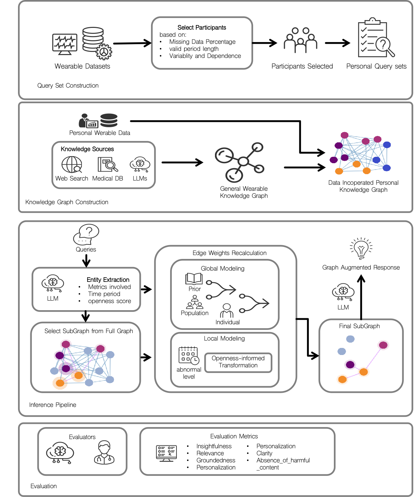

## WAG: Query-Conditioned Graph Retrieval for Contextualized LLM Reasoning in Personalized Wearable Data
### AACL-IJCNLP 2026 | [Project Page](https://scottlu04.github.io/Wearable-As-Graph-WAG/) | Paper (coming soon)



Official implementation of **Wearable As Graph (WAG)**, a query-conditioned graph retrieval
framework for LLM reasoning over longitudinal wearable-health data. WAG builds a personalized
wearable knowledge graph, retrieves a query-conditioned subgraph, and uses that context to
support LLM reasoning over personal time-series signals.

The project page carries an interactive explorer for the 102-metric wearable knowledge graph,
and the per-dataset coverage of the 52 metrics that are grounded in wearable data.


## Repository Structure

```text
WAG/
├── graph_construction/      # Knowledge graph construction and extension
├── query_generation/        # Data-grounded wearable query generation
├── response_generation/     # Base/RAG/StaticGraph/FullContext/WAG processors
├── evaluation/              # LLM-as-a-judge evaluation pipeline
├── shared/                  # Shared models, prompts, utilities, retrieval package
├── scripts/                 # Main shell entrypoints and helper scripts
├── resources/               # KG, processed datasets, generated queries
├── run_experiments.py       # Unified response-generation experiment runner
└── requirements.txt
```

## Run The Pipeline

Build or update the wearable knowledge graph:

```bash
./scripts/run_graph_construction.sh
```

Generate data-grounded queries:

```bash
./scripts/run_query_generation.sh
```

Run the general response-generation experiment:

```bash
./scripts/run_experiments.sh general 10
```

Evaluate generated responses:

```bash
./scripts/run_evaluation.sh general
```

Run everything in sequence:

```bash
./scripts/run_all.sh
```

## Response-Generation Methods

- **Base**: uses only the query-associated personal wearable data.
- **RAG**: retrieves graph context directly related to the primary detected metric.
- **StaticGraph**: ranks related nodes using static prior graph edge weights.
- **FullContext**: provides all available wearable metrics within the query time window.
- **WAG**: retrieves related nodes using query-conditioned global/local graph weighting.

Optional methods can be selected explicitly with `--methods`, for example:

```bash
python run_experiments.py \
  --experiments general \
  --generate-response \
  --methods Base Rag StaticGraph FullContext Wag
```

## Data And Resources

The `resources/` directory contains the default assets expected by the scripts:

- `resources/kg/`: graph nodes and edges.
- `resources/query_set/`: generated wearable-health queries.
- `resources/processed_dataset/`: processed dataset tables.
- `resources/relationship_dict.json`: precomputed relationship statistics.

If you redistribute this repository publicly, please verify that the licenses and
terms of the underlying datasets are compatible with your release plan.

## Outputs

Generated outputs are written under ignored directories such as:

- `results/response_gen/`
- `results/evaluation/`
- `logs/`

These are intentionally not part of the clean open-source copy.

## Tests

```bash
python -m unittest discover
```

## License

MIT License. See `LICENSE`.

## Citation

```bibtex
@inproceedings{lu2026wag,
  title     = {{WAG}: Query-Conditioned Graph Retrieval for Contextualized
               {LLM} Reasoning in Personalized Wearable Data},
  author    = {Lu, Zhenyu and Abbasian, Mahyar and Rahmani, Amir M.},
  booktitle = {Proceedings of the 5th Conference of the Asia-Pacific Chapter of
               the Association for Computational Linguistics and the 15th
               International Joint Conference on Natural Language Processing
               (AACL-IJCNLP 2026)},
  year      = {2026}
}
```
